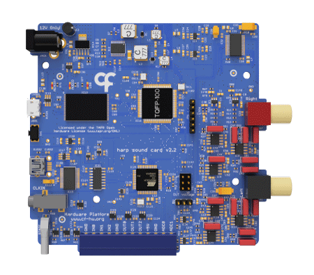

## Harp Soundcard
This is a high performance sound card with two output channels using 24 bits DACs at 192kHz sample rate. 

### Key Features

* Internal memory to store sounds, enabling low-latency sound delivery
* Pre-selected sounds can be triggered using an external TTL
* Internal wave generator allows the user to configure a pure tone without loading a sound file
* Stereo 24 bit @ 192 kHz maximum sampling rate outputs
* THD: -111dB (1 kHz @ 2 V rms)
* Noise Floor:	20 µV rms | -94 dB (20 Hz – 80 kHz)
* SNR:	100 dB | 113 dbA (20 Hz – 80 kHz @ 2 V rms)

### Hardware Compatibility

| HW Version | Board                    | Board HW Version  | Notes                             |
| ---------- | ------------------------ |------------------ | --------------------------------- |
| **All**    | [Peripheral.AudioAmp][1] | >= 2.0            |                                   |

[1]: https://github.com/harp-tech/peripheral.audioamp

### Firmware Compatibility

| FW Version | Board                 | Board HW Version | Notes                                   |
| ---------- | --------------------- | ---------------- | --------------------------------------- |
| **>= 2.2** | [Device.SoundCard][2] | >= 1.0           | Bpod serial communication not supported |
| **<= 2.2** | [Device.SoundCard][2] | >= 1.0           |                                         |

[2]: https://github.com/harp-tech/device.soundcard

### Licensing

Each subdirectory will contain a license or, possibly, a set of licenses if it involves both hardware and software.