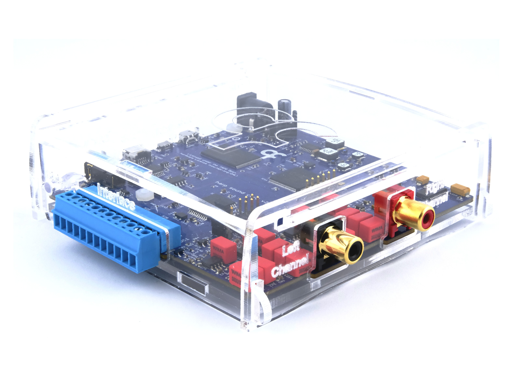

## Harp Soundcard

The SoundCard is an open-source, high-fidelity audio device that is specifically designed for behavioral research experiments. It can be triggered with low latency, conforms to the [Harp](https://harp-tech.org/articles/about.html) protocol for synchronization, and integrates with [Bonsai](https://bonsai-rx.org/) for experiment acquisition and control.

{width=450}

For a full characterization, see the [publication](https://doi.org/10.1016/j.ohx.2024.e00555).

Assembled units are available from the [Open Ephys store](https://open-ephys.org/harp), or build your own using the [hardware design files](https://github.com/harp-tech/device.soundcard). 

### Key Features

* Internal memory to store sounds, enabling low-latency sound delivery
* Pre-selected sounds can be triggered using an external TTL
* Internal wave generator allows the user to configure a pure tone without loading a sound file
* Stereo 24 bit @ 192 kHz maximum sampling rate outputs
* THD: -111dB (1 kHz @ 2 V rms)
* Noise Floor:	20 µV rms | -94 dB (20 Hz – 80 kHz)
* SNR:	100 dB | 113 dbA (20 Hz – 80 kHz @ 2 V rms)

### Hardware Compatibility

| HW Version | Board                    | Board HW Version  | Notes                             |
| ---------- | ------------------------ |------------------ | --------------------------------- |
| **All**    | [Peripheral.AudioAmp][1] | >= 2.0            |                                   |

[1]: https://github.com/harp-tech/peripheral.audioamp

### Firmware Compatibility

| FW Version | Board                 | Board HW Version | Notes                                   |
| ---------- | --------------------- | ---------------- | --------------------------------------- |
| **>= 2.2** | [Device.SoundCard][2] | >= 1.0           | Bpod serial communication not supported |
| **<= 2.2** | [Device.SoundCard][2] | >= 1.0           |                                         |

[2]: https://github.com/harp-tech/device.soundcard

### Licensing

Each subdirectory will contain a license or, possibly, a set of licenses if it involves both hardware and software.

### Acknowledgments

Hardware design and GUI contributed by [Champalimaud Foundation](https://www.cf-hw.org/), Bonsai interface by [Neurogears](https://neurogears.org/), and documentation by [Open Ephys](https://open-ephys.org/).