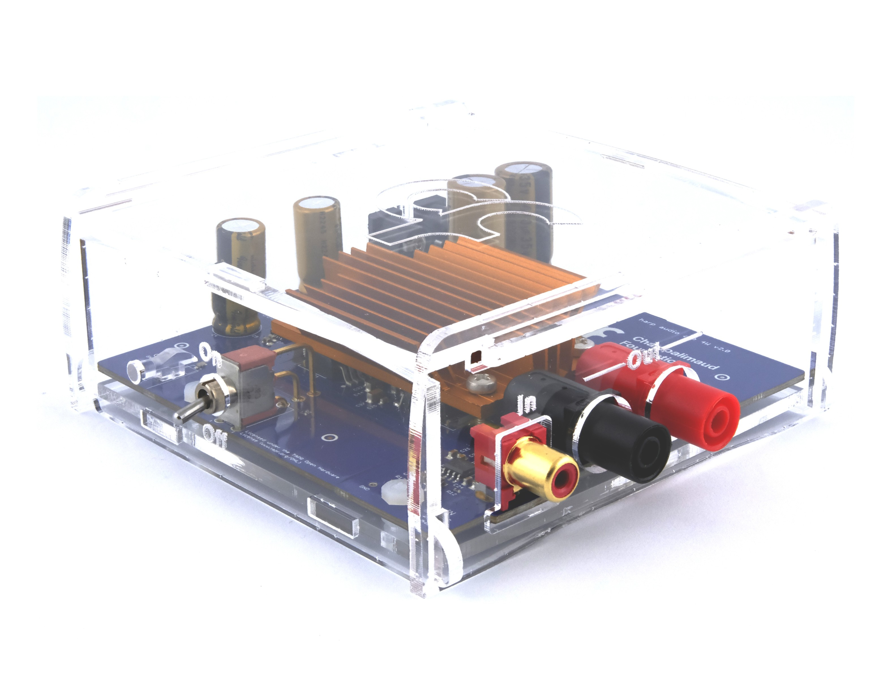
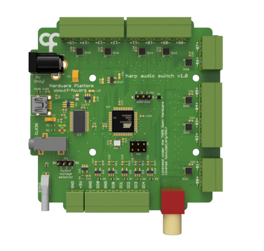

## Harp Audio Amplifier

Low distortion, high-bandwidth audio amplifier designed to pair with the SoundCard for high-fidelity speaker output.

{width=450}

For a full characterization, see the [publication](https://doi.org/10.1016/j.ohx.2024.e00555).

Assembled units are available from the [Open Ephys store](https://open-ephys.org/harp), or build your own using the [hardware design files](https://github.com/harp-tech/peripheral.audioamp).

### Key Features

- Unity gain

### Specs

- Number of channels: 1
- Input voltage: 2 × 12 V DC (positive and negative supply)
- Speaker output (with SoundCard): 0.5 W @ 8 Ω / 1 W @ 4 Ω

### Benchmarks

- SNR: 119 dB (A-weighted 80kHz bandwidth)
- Spectral variation: <0.1dB 20Hz - 80kHz
- Distortion: <0.03% @ 1W

### Speakers

* Audio speakers with ~4 Ohms or higher can be used with this amplifier
* The XT25SC90-04 speaker from Peerless by Tymphany is recommended due to its good frequency response up to 80 kHz

---

## Harp Audio Switch

This is a multiplexer device that allows an analog input signal to be forwarded to several output channels. It allows forwarding an audio signal to a single speaker or a combination of speakers. The configuration of speakers can be predefined by software or by using a set of digital inputs.

Assembled units are available from the [Open Ephys store](https://open-ephys.org/harp), or build your own using the [hardware design files](https://github.com/harp-tech/device.audioswitch).

### Key Features

* Configuration of up to 15 speakers (depending on the input signal strength)
* Several speakers can be activated concurrently

[!INCLUDE ]