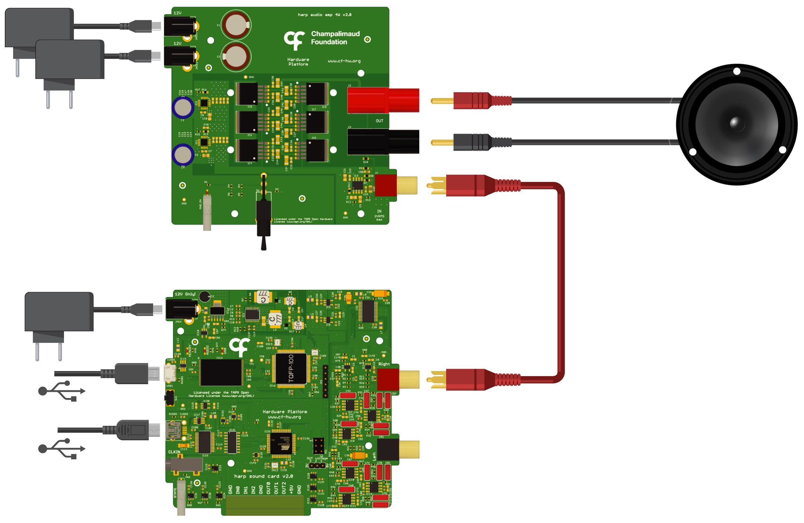

# Connections

{width=450}

*<small>Single channel connection diagram with Harp Audio Amplifier and attached speaker. Reproduced from [Silva et al. (2024)](https://doi.org/10.1016/j.ohx.2024.e00555). CC BY 4.0.</small>*

**Amplifier** - The `SoundCard` requires an external amplifier. For high-fidelity applications, consider using the [Harp Audio Amplifier](https://github.com/harp-tech/peripheral.audioamp).

**Speaker** - The choice of speaker depends on the amplifier. For the `Harp Audio Amplifier`, any speaker with an impedance from 4 to 8 ohms can be used. The XT25SC90-04 (Peerless by Tymphany) has been tested and has a good frequency response up to 80 kHz.

## Testing the device

:::workflow

:::

- Hover over the workflow cell above, click the "Copy" icon in the top right, and paste the workflow into Bonsai.
- Set the `PortName` property of the [`SoundCard`](xref:Harp.SoundCard.Device) operator to the communications port of the `SoundCard` (e.g. COM7).
- Run the workflow. If the `SoundCard` is properly connected, you should hear a short tone.

[!INCLUDE ]