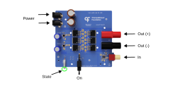
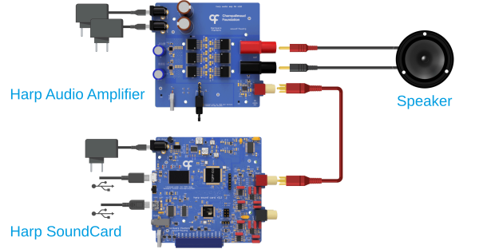
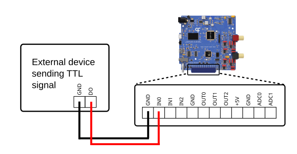
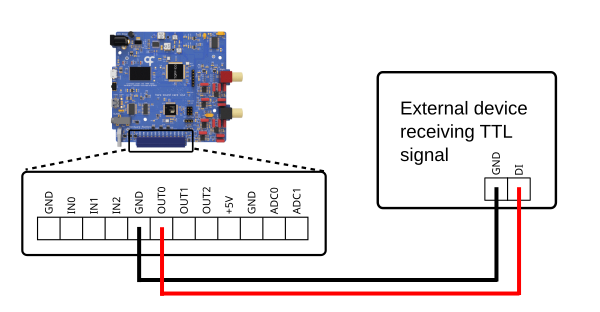
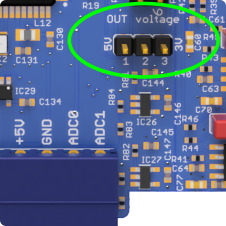
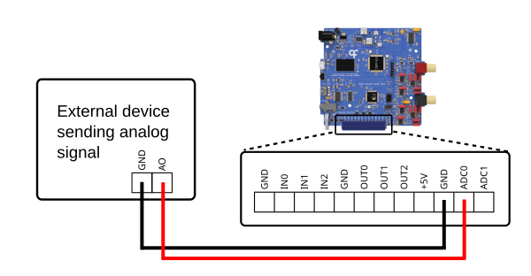

## Ports and Connections

This article will cover the ports, controls and indicators on the SoundCard and Audio Amplifier, as well as how to connect them to each other and to external devices.

### SoundCard

{width=600}

#### Ports

**12V PWR (Barrel Jack)** - This port powers the SoundCard and requires a 12 V power supply.

**USB (Soundbank, Micro-B)** - This port connects to the device's onboard sound memory bank for uploading of waveforms. Once the sounds have been uploaded, the cable can be disconnected, as it is not required for sound playback.

**USB (Computer, Mini-B)** - This port connects to the device's internal controller to control sound playback with [Bonsai](harp-bonsai.md) or the [GUI](upload-waveform-gui.md).

**CLK IN (Stereo Jack)** - This [Harp](https://harp-tech.org/articles/about.html) clock input port accepts a clock output from any compatible Harp clock generator or synchronizer (e.g. [Timestamp Generator Gen3](https://github.com/harp-tech/device.timestampgeneratorgen3)), which can be used to synchronize the internal clocks of connected devices. 

**Interface (Screw Terminal)** - These general purpose input/output (GPIO) pins can be used to communicate with external devices, for example to trigger sound playback or control volume. Refer to the connection guide below for more information.

**Left Channel (RCA)** - This port can be used independently for mono output or together with the right channel for stereo output. Needs to be connected to an external amplifier and speakers.

**Right Channel (RCA)** - This port can be used independently for mono output or together with the left channel for stereo output. Needs to be connected to an external amplifier and speakers.

#### Controls

**RST** - This button resets the sound controller in case of an error during sound upload or playback (not typically needed). The reset does not remove sounds stored in the soundbank or affect the connection between Bonsai and the device.

#### Indicators

**State** - The LED cycles on and off with a period of:

- 2 seconds when it's communicating with Bonsai
- 4 seconds when in standby
- 100 milliseconds when a catastrophic error occurs

**Memory** - This LED turns on when the device is reading or writing to the soundbank. If it remains on, there is a problem accessing the soundbank.

**Audio** - This LED turns on while the device is producing audio.

**USB** - This LED turns on when sounds are being uploaded to the soundbank. It also remains on if the device does not detect a connection between the computer and soundbank.

### Audio Amplifier

{width=600}

**Power (Barrel Jack)** - These ports power the amplifier and require two separate 12 V power supplies, one for each power input.

**In (RCA)** - This port accepts a input from one of the SoundCard's [output channels](#ports).

**Out (Banana Plug, +/-)** - These terminals connect to the positive and negative terminals on a speaker.

**On** - This switch turns on and off the amplifier.

**State** - This LED will turn on if the amplifier is powered and the **On** switch is enabled.

### Connections

#### Audio Setup

{width=450}

*<small>Adapted from [Silva et al. (2024)](https://doi.org/10.1016/j.ohx.2024.e00555). CC BY 4.0.</small>*

1. Connect the power supply to the SoundCard.
2. Connect the SoundCard to the computer with the USB Mini-B cable for communication.
3. (Optional) Connect the SoundCard to the computer with the USB Micro-B cable if you wish to [upload waveforms](./upload-waveform-gui.md) for playback.
4. Connect one of the output channels on the device via RCA cables to an input channel on an external amplifier.

> [!NOTE]
> Any external amplifier that accepts line-level RCA inputs is supported. For high-fidelity applications, consider using the Harp [Audio Amplifier](./peripherals/audio-peripherals.md) (pictured above).

5. Connect the power supply to the amplifier. The Harp Audio Amplifier requires two separate 12 V supplies, one for each power input.

> [!WARNING]
> Do not connect a single 12 V supply to both power inputs on the Harp Audio Amplifier — this will result in a short circuit.

6. Connect the speaker terminals on the amplifier to a speaker.

> [!NOTE]
> The choice of speaker depends on the amplifier's rated impedance and power. For the Harp Audio Amplifier, any speaker with an impedance from 4 to 8 ohms can be used. The XT25SC90-04 (Peerless by Tymphany) has been tested and offers a good frequency response up to 80 kHz.

7. Repeat steps 4-6 to connect a second amplifier-speaker pair if you need stereo output.

#### Digital Input

{width=450}

1. Connect a digital output from another device to one of the digital input pins (IN0-IN2).
2. Connect the ground of the other device to one of the GND pins, so that both share a common ground.
3. Refer to the [Configure Digital Input](configure-digitalinput.md) article to configure the digital input mode in Bonsai.

> [!NOTE]
> The digital input lines run on 3.3 V logic levels but are 5 V tolerant.

#### Digital Output

{width=450}

1. Connect one of the digital output pins (OUT0-OUT2) to a digital input on the other device.
2. Connect the ground of the other device to one of the GND pins, so that both share a common ground.
3. Follow the [Configure Digital Output](configure-digitaloutput.md) article to configure the digital output mode in Bonsai.

> [!NOTE]
> The logic level of the digital output lines is set to 5 V by default, but can be switched to 3.3 V using the **OUT voltage** jumper located near the **Interface** connector. The setting applies to all three outputs.
>
> {width=150}

#### Analog Input

{width=450}

1. Connect an analog output from another device to one of the analog input pins (ADC0-ADC1).
2. Connect the ground of the other device to one of the GND pins, so that both share a common ground.
3. Follow the [Configure Analog Input](configure-analoginput.md) article to configure the analog input mode in Bonsai.

> [!NOTE]
> The analog input lines accept a voltage range from 0 to 5 V.

[!INCLUDE ]