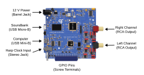
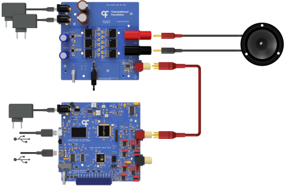

## Ports

{width=600}

**Power** - This port requires a 12 V power supply (wall adapter included with device).

**Soundbank** - This port connects to the device's onboard sound memory bank for uploading of waveforms. Once the sounds have been uploaded, this cable can be disconnected, as it is not required for sound playback.

**Computer** - This port connects to the device's internal controller to control sound playback with [Bonsai](harp-bonsai.md) or the [GUI](upload-waveform-gui.md).

**Harp Clock Input** - This port connects to a [Harp Timestamp Generator](https://github.com/harp-tech/device.timestampgeneratorgen3) output, which can be used to synchronize the internal clocks of connected [Harp](https://harp-tech.org/articles/about.html) devices to a precision of +/- 64 us.

**GPIO** - The general purpose input/output (GPIO) pins can be used to communicate with external devices to trigger sound playback, control volume, etc. The following pins are provided:

* 3x general purpose digital outputs (3.3V or 5V) (OUT0-OUT2)
* 3x general purpose digital inputs (5V tolerant) (IN0-IN2)
* 2x analog inputs (3.3V max - 5V tolerant) (ADC0-ADC1)

For more information on how to use them, refer to the [GPIO](trigger-sound.md) article.

**Audio Channels** - The left and right channels can be used independently for mono output or together for stereo output.

## Audio Setup

To play sounds, the SoundCard must be connected to external amplifiers and speakers. 

{width=450}

*<small>Adapted from [Silva et al. (2024)](https://doi.org/10.1016/j.ohx.2024.e00555). CC BY 4.0.</small>*

**Amplifier** - Any external amplifier that accepts line-level RCA inputs is supported. For high-fidelity applications, consider using the [Harp Audio Amplifier](audio-peripherals.md#harp-audio-amplifier) (pictured above).

**Speaker** - The choice of speaker depends on the amplifier's rated impedance and power. For the `Harp Audio Amplifier`, any speaker with an impedance from 4 to 8 ohms can be used. The XT25SC90-04 (Peerless by Tymphany) has been tested and offers a good frequency response up to 80 kHz.

[!INCLUDE ]