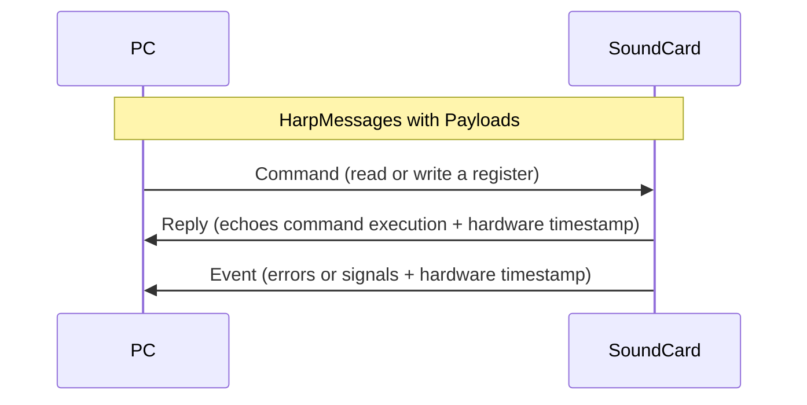

## Harp Communication Protocol

[Harp devices](https://harp-tech.org/articles/about.html) are controlled by a host PC using the [Harp Protocol](https://harp-tech.org/protocol/BinaryProtocol-8bit.html). Communication is structured as [`HarpMessages`](https://harp-tech.org/api/Bonsai.Harp.HarpMessage.html), which are linked to `Registers` on the device. `Registers` are addresses for specific functions on the device (such as the command to play a sound). They will also carry a message `Payload` (such as the index of the sound to play from the sound bank).

After the host PC sends the command, the device will send a reply back with the register that was executed as well as the hardware timestamps. 

In addition, the device can send event messages without a command from the host PC. These include events such as error messages, or signals from analog/digital inputs. 

## Harp Bonsai Interface

While there are several ways of controlling the `SoundCard`, [Bonsai](https://bonsai-rx.org/) offers the most flexible and complete control of the SoundCard as it exposes every register available on the device. It also integrates well with hundreds of open source and closed source hardware and software that are used in the neuroscience community.

For users unfamiliar with Bonsai, it is a visual programming language, where functions are represented by operators/nodes. Operators connect together to form data processing pipelines that are embedded in scripts called workflows. For instance, a simple example of the Harp communication protocol above, as represented in Bonsai, will look like this:

:::workflow

:::

- `KeyDown` - This is an example of a [Source](https://bonsai-rx.org/docs/articles/operators.html?tabs=quantitative-operators%2Cmulti-sample-operators#source) operator, which produces a stream of elements or data. In Bonsai, there are many types of sources, such as timers or analog or digital signals. In this instance, we can use keyboard keys to trigger the creation of a `HarpMessage` in the next node.

- `CreateMessage` - This is another [Source](https://bonsai-rx.org/docs/articles/operators.html?tabs=quantitative-operators%2Cmulti-sample-operators#source) operator, which in this case creates a `HarpMessage` to send to the device in the next connected node. In a `CreateMessage` operator, you would select the `Register` as well as the `Payload` values to send.

- `Device` - This operator is used to initialize and communicate with the device, in this case receiving commands to send as well as issuing replies and events, which can be read in the next node.

- `Parse` - This operator is used to filter and read the `HarpMessages`. Similar to the `CreateMessage` operator, you would select the `Register` to filter the messages to listen to.

If you have installed the Bonsai `Harp.SoundCard` package, once you have selected the `Register` and `Payload`, the same operators will morph to reflect the `Register` and `Payload` that is selected.

:::workflow

:::

## Harp Device Pattern

Set up the standard Harp [device pattern](../articles/operators.md#device-pattern) to initialize the device, log data, broadcast events, and send commands to the `SoundCard`.

:::workflow

:::

- Insert a [`Device`] operator and set the `PortName` property to the communications port for the device.
- Insert a [`DeviceDataWriter`] sink and set the `Path` property (e.g. `SoundCard.harp`). 
   - This will save the data in the standard Harp logging format, which can be loaded with [`harp-python`](../articles/python.md).
- Insert a [`PublishSubject`] operator and name it `SoundCard Events`.
- Right-click the [`Device`] operator, select "Create Source (Bonsai.Harp.HarpMessage)" > "BehaviorSubject". 
   - Name the generated [``BehaviourSubject`1``] [source subject](https://bonsai-rx.org/docs/articles/subjects.html#source-subjects) `SoundCard Commands`. 
   - Connect it as input to the [`Device`] operator.

## Harp Bonsai Test

:::workflow

:::

- Hover over the workflow cell above, click the "Copy" icon in the top right, and paste the workflow into Bonsai.
- Set the `PortName` property of the [`SoundCard`](xref:Harp.SoundCard.Device) operator to the communications port of the `SoundCard` (e.g. COM7).
- Run the workflow. If the `SoundCard` is properly connected, you should hear a short tone.

[!INCLUDE ]

<!--Reference Style Links -->
[`AttenuationAndPlaySoundOrFreq`]: xref:Harp.SoundCard.AttenuationAndPlaySoundOrFreq
[`AttenuationAndPlaySoundOrFreqPayload`]: xref:Harp.SoundCard.CreateAttenuationAndPlaySoundOrFreqPayload
[``BehaviourSubject`1``]: xref:Bonsai.Reactive.BehaviorSubject
[`ConfigureDI0Payload`]: xref:Harp.SoundCard.CreateConfigureDI0Payload
[`SoundIndexDI0Payload`]: xref:Harp.SoundCard.CreateSoundIndexDI0Payload
[`CreateMessage`]: xref:Harp.SoundCard.CreateMessage
[`Device`]: xref:Harp.SoundCard.Device
[`DeviceDataWriter`]: xref:Harp.SoundCard.DeviceDataWriter
[`HarpMessage`]: xref:Bonsai.Harp.HarpMessage
[`KeyDown`]: xref:Bonsai.Windows.Input.KeyDown
[`Merge`]: xref:Bonsai.Reactive.Merge
[`MulticastSubject`]: xref:Bonsai.Expressions.MulticastSubject
[`PlaySoundOrFrequency`]: xref:Harp.SoundCard.PlaySoundOrFrequency
[`PlaySoundOrFrequencyPayload`]: xref:Harp.SoundCard.CreatePlaySoundOrFrequencyPayload
[`PublishSubject`]: xref:Bonsai.Reactive.PublishSubject
[`Stop`]: xref:Harp.SoundCard.Stop
[`StopPayload`]: xref:Harp.SoundCard.CreateStopPayload
[`SubscribeSubject`]: xref:Bonsai.Expressions.SubscribeSubject
[`SubscribeWhen`]: xref:Bonsai.Reactive.SubscribeWhen
[`Take`]: xref:Bonsai.Reactive.Take
[`Timer`]: xref:Bonsai.Reactive.Timer