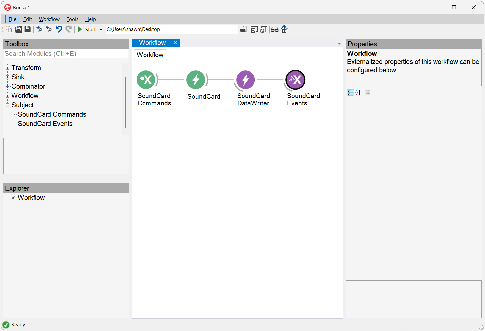

## Software packages

These steps are only required the first time you connect the SoundCard to a new computer. Feel free to install only the packages you need.

### WinUSB 

The WinUSB driver is required to upload waveforms to the onboard sound memory bank.

{width=600}

- Download and launch [Zadig](https://zadig.akeo.ie/).
- Connect the [USB Micro-B](connections.md) cable to the computer.
- Select the "Harp Sound Card" from the list. If the device is not available, go to "Options" > "List All Devices".
- Select the "WinUSB" driver and click "Install Driver".

### SoundCard GUI

The SoundCard GUI offers a graphical interface for [generating and uploading waveforms](upload-waveform-gui.md). 

{width=600}

- Download and install the [SoundCard GUI](https://github.com/fchampalimaud/device.soundcard/releases/tag/app1.0.0-alpha.1).

> [!NOTE]
> Alternatively, waveforms can be [generated and uploaded in Bonsai](../tutorials/upload-waveform-bonsai.md).

### Bonsai

[Bonsai](https://bonsai-rx.org/) is a visual reactive programming language that provides flexible and comprehensive control of the SoundCard.

{width=600}

- Download and install [Bonsai](https://bonsai-rx.org/docs/articles/installation.html).

{width=600}

- Launch Bonsai and install the `Harp.SoundCard` package by searching for it in the [Bonsai package manager](https://bonsai-rx.org/docs/articles/packages.html).
- (Optional) Install the `Bonsai.Windows.Input` package to follow along with the examples in this user guide.

### harp-python

The [harp-python](https://pypi.org/project/harp-python/) library provides a low-level interface to [read and manipulate](visualize-data.md) data from Harp devices. You can install it in a Python environment with:

```cmd
pip install harp-python 
```

## Firmware

| Tag | Description |
| - | - |
| SoundCard-* | Firmware for the sound card's microcontroller (8 bits processor) |
| SoundCard.PIC32-* | Firmware for the sound card's 32 bits processor |

### Updating the firmware

1 - Install the [Harp Converto to CSV](https://bitbucket.org/fchampalimaud/downloads/downloads/Harp_Convert_To_CSV_v1.8.3.zip).

2 - Open the Harp Convert to CSV application and write *bootloader* under List box on the Options tab

3 - Select the correspondent COM port and then select the firmware to be loaded for both microcontrollers 

[!INCLUDE [](version-footer.md)]