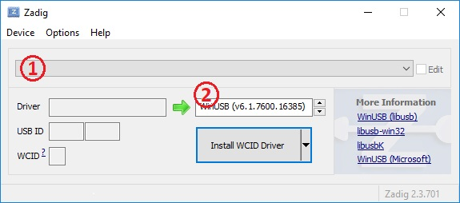
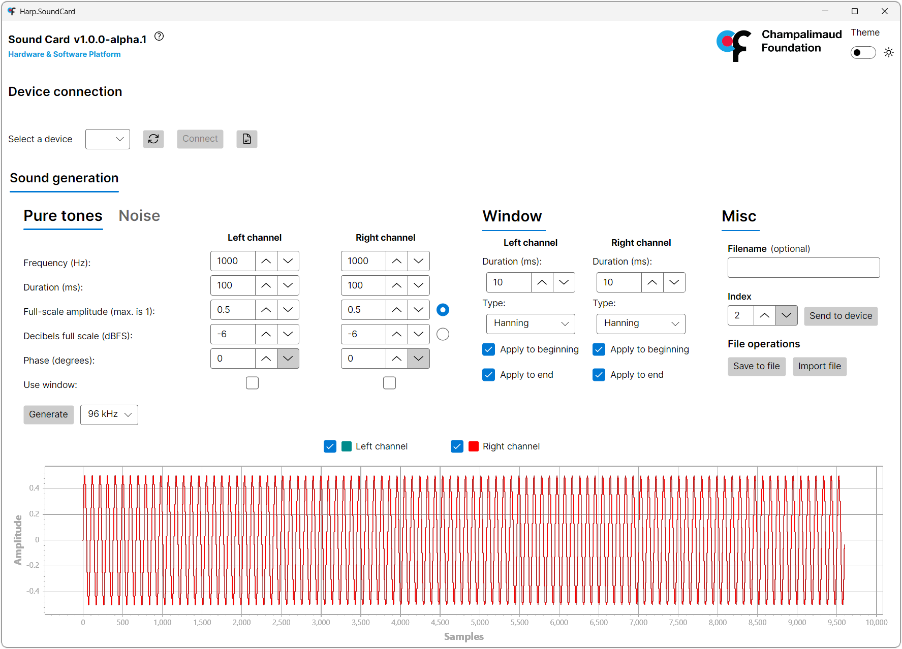
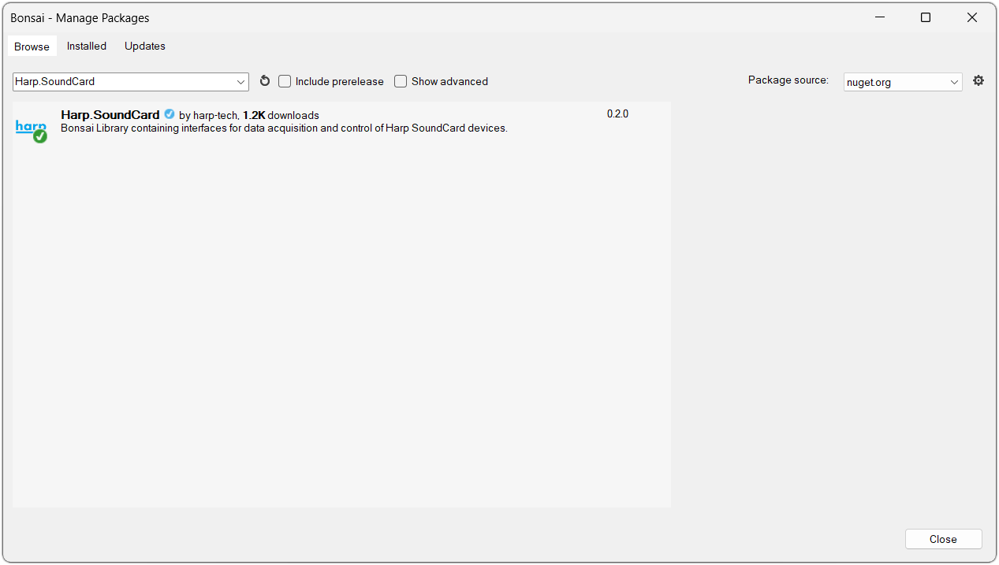

## Installation

This page covers the software you'll need to interact with the SoundCard, as well as how to update the firmware on the device.

## Software Packages

These steps are only required the first time you connect the device to a new computer, and you can install just the packages for the functionality you need.

# [Driver](#tab/driver)

The WinUSB driver is required to upload waveforms to the onboard sound memory bank.

{width=600}

- Download and launch [Zadig](https://zadig.akeo.ie/).
- Connect the [USB Micro-B](connections.md) cable to the computer.
- Select the "Harp Sound Card" from the list. If the device is not available, go to "Options" > "List All Devices".
- Select the "WinUSB" driver and click "Install Driver".

# [SoundCard GUI](#tab/soundcard-gui)

The SoundCard GUI offers a graphical interface for [generating and uploading waveforms](upload-waveform-gui.md). 

{width=600}

- Download and install the [SoundCard GUI](https://github.com/fchampalimaud/device.soundcard/releases/tag/app1.0.0-alpha.1).

> [!NOTE]
> Alternatively, waveforms can be [generated and uploaded in Bonsai](../tutorials/upload-waveform-bonsai.md).

# [Bonsai](#tab/bonsai)

[Bonsai](https://bonsai-rx.org/) is a visual reactive programming language that provides flexible and comprehensive control of the SoundCard.

{width=600}

- Download and install [Bonsai](https://bonsai-rx.org/docs/articles/installation.html).
- Launch Bonsai and install the `Harp.SoundCard` package by searching for it in the [Bonsai package manager](https://bonsai-rx.org/docs/articles/packages.html).
- (Optional) Install the `Bonsai.Windows.Input` package to follow along with the examples in this user guide.

# [harp-python](#tab/harp-python)

The [harp-python](https://pypi.org/project/harp-python/) library provides a low-level interface to [read and manipulate](visualize-data.md) data from Harp devices. You can install it in a Python environment with:

```cmd
pip install harp-python 
```

***

## Firmware

New features are added and bugs are fixed with firmware updates which are published on the [release page](https://github.com/harp-tech/device.soundcard/releases) in the SoundCard repository. Each firmware release is tagged with a `fw` prefix (e.g. `fw2.2-harp1.13`), and the files can be found in the "Assets" section. To update the firmware:

- Download two files matching this format for the hardware version of your device:
   - `SoundCard-*.hex` - Firmware for the 8-bit device interface microcontroller.
   - `SoundCard.PIC32-*.hex` - Firmware for the 32-bit sound memory microcontroller.

>[!TIP]
> The hardware version is printed on the board silkscreen and should match the `hwX.X` portion of the firmware filename.

- Install the [Labview Runtime](https://bitbucket.org/fchampalimaud/downloads/downloads/Runtime-1.0.zip).
- Install the [Harp Convert to CSV](https://bitbucket.org/fchampalimaud/downloads/downloads/Harp_Convert_To_CSV_v1.8.3.zip) application.
- Open the Harp Convert to CSV application and write *bootloader* under "List" box on the "Options" tab.
- Select the corresponding COM port and then select the firmware to be loaded for both microcontrollers.

> [!NOTE]
> This method should be replaced by either [Harp-Toolkit](https://harp-tech.org/toolkit/) or [Harp-Regulator](https://github.com/harp-tech/harp-regulator) when they become available and support the SoundCard.

[!INCLUDE [](version-footer.md)]