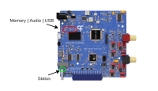

## Indicators and Errors

This article covers how to read the SoundCard's status indicators and resolve common connection errors.

### Indicator Lights

The SoundCard has onboard LED indicators that can be used to troubleshoot common errors. 

{width=600}

The green `Status` LED cycles on and off with a period of:

- 2 seconds when it's communicating with Bonsai
- 4 seconds when in standby
- 100 ms when a catastrophic error occurs

The three red LEDs:

- `Memory` will turn ON when accessing the memory
- `Audio` will turn ON when producing audio.
- `USB` will turn ON when communicating through USB or the USB communication is not available

### COM Port Errors

**Q: In Bonsai, running the workflow throws an error "The port `ComX` does not exist."**

A: Either the wrong communications port in the `PortName` property in [`Device`] was selected, or the [USB mini-B](connections.md) cable is not properly connected. Try selecting a different communications port and checking the connection.

**Q: In Bonsai, running the workflow throws an error "Access to the port `ComX` is denied"**

A: Only one interface connection to the SoundCard can be opened at one time. Check that Bonsai and the SoundCard GUI are not running simultaneously. Also check that multiple instances of either are not running. 

Sometimes, the port can be also be locked by a program that did not terminate correctly, restarting the computer fixes it.

Another possible source of the error is that the wrong communications port was selected, try selecting a different communications port for the device.

<!--Reference Style Links -->
[`Device`]: xref:Harp.SoundCard.Device