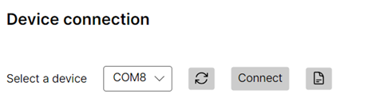
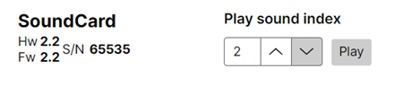
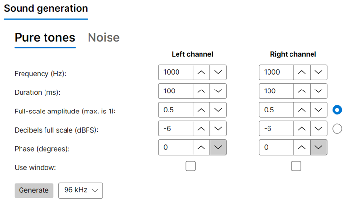
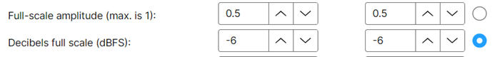

## Upload waveforms

The SoundCard GUI provides an easy to use interface to generate and upload sounds to the SoundCard.

## Connecting to the device

1) Follow the audio setup [guide](connections.md#audio-setup) and connect the [USB mini-b](connections.md#ports) cable to the computer.

2) Launch "Harp.SoundCard.App" from the Windows Start menu.

3) Select the port for the SoundCard, and press "Connect".

{width=400}

4) The device details will display if it is successfully connected.

{width=400}

> [!TIP]
> If you run into an error, check out the troubleshooting [guide](./troubleshooting.md).

## Generating sounds 

1) The SoundCard GUI supports generation of pure tones and noise waveforms. Select the tab for the type you want to generate.

{width=400}

2) Adjust the properties for the sound accordingly.

3) Amplitude can be adjusted as a fraction of full-scale (linear) or in dBFS (logarithmic). Select the radio button for the option you want.

{width=400}

> [!TIP]
> dBFS matches the logarithimic nature of human loudness perception.

4) A windowing function can be applied to the start and end of the waveform, this helps to prevent "pops" and "clicks" from abrupt transitions. The window properties are taken from the adjacent panel.

[!INCLUDE ]