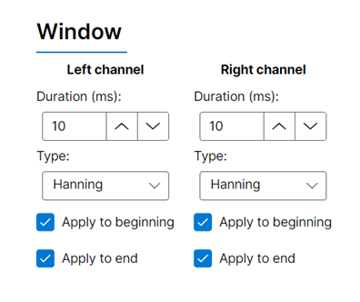

## Upload waveforms

The SoundCard GUI provides an easy to use interface to generate and upload sounds to the SoundCard. Alternatively, you can also [generate and upload sounds in Bonsai](../tutorials/upload-waveform-bonsai.md).

## Connecting to the device

1) Follow the audio setup [guide](connections.md#audio-setup) and connect the [USB mini-b](connections.md#ports) cable to the computer.

2) Launch "Harp.SoundCard.App" from the Windows Start menu.

3) Select the port for the SoundCard, and press "Connect".

{width=400}

4) The device details will display if it is successfully connected.

{width=400}

> [!TIP]
> If you run into an error, check out the troubleshooting [guide](./troubleshooting.md).

## Generating sounds 

1) Select the tab for either pure tone or white noise generation:

{width=400}

2) Adjust the parameters for the sound accordingly:

- **Amplitude** can be adjusted as a fraction of full-scale (linear) or in dBFS (logarithmic). Select the radio button for the option you want.

{width=400}

> [!TIP]
> dBFS matches the logarithimic nature of human loudness perception.

- **Window** can be applied to the start and end of the waveform, this helps to prevent "pops" and "clicks" from abrupt transitions. Select the channels to apply the window to:

{width=400}

And adjust the window properties on the adjacent panel:

{width=400}

3) Choose the sampling rate and click on "Generate":

[!INCLUDE ]