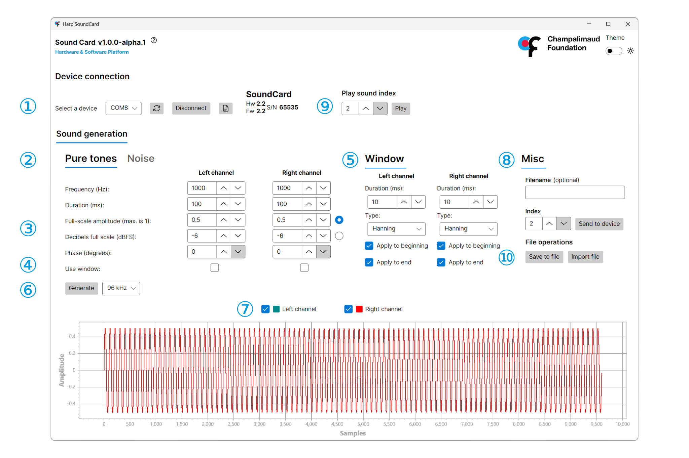

## Upload waveforms

The SoundCard GUI provides an easy to use interface to generate and upload sounds to the SoundCard. Alternatively, you can [generate and upload sounds in Bonsai](../tutorials/upload-waveform-bonsai.md), which offers greater flexibility and functionality.

Before beginning, follow the audio setup [guide](connections.md#audio-setup) and connect the [USB mini-b](connections.md#ports) cable to the computer. Launch "Harp.SoundCard.App" from the Windows Start menu.

1. Select the port for the SoundCard, and press "Connect". The device details will display on the right side if it is successfully connected.

> [!TIP]
> If you run into an error, check out the troubleshooting [guide](./troubleshooting.md).

2. Select the tab for either pure tone or white noise generation:

3. Adjust the parameters for the sound accordingly. Take note that amplitude can be adjusted as a fraction of full-scale (linear) or in dBFS (logarithmic). Select the radio button for the option you want.

> [!TIP]
> dBFS matches the logarithimic nature of human loudness perception.

4. To prevent "pops" and "clicks" from abrupt transitions during sound onset or sound offset, a windowing function can be applied to fade in or out the sound. Select the channels to apply the window to.

5. Adjust the window properties in this panel.

6. Choose the sampling rate and click on "Generate". The choice of sampling rate will determine both the range of reproducible frequencies. 

7. Select the channels to upload

8. Configure the sound index to upload and upload the sound to the device.

9. Press "Play" on the sound.

[!INCLUDE ]