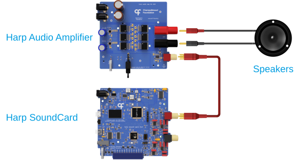

## Overview

The Harp [SoundCard](articles/soundcard-overview.md) and [Audio Amplifier](articles/audio-peripherals.md) are open-source, high-fidelity audio devices specifically designed for behavioral research experiments. 

{width=450}

*<small>Adapted from [Silva et al. (2024)](https://doi.org/10.1016/j.ohx.2024.e00555). CC BY 4.0.</small>*

Consumer-grade audio systems are designed to operate within the human auditory domain, are not optimized for real-time audio applications, and rarely support synchronization or precise triggering of auditory stimuli. 

The SoundCard provides:

- Wideband frequency support up to 80 kHz, suitable for experiments involving ultrasonic communication.
- Onboard storage and digital input triggering for low-latency sound playback.
- Hardware timestamping and synchronization with other [Harp](https://harp-tech.org/articles/about.html) devices.
- [Bonsai](https://bonsai-rx.org/) integration for flexible experiment acquisition and control.

The Audio Amplifier provides low-distortion amplification of SoundCard signals, which is required for driving speakers for sound playback.

A full end-to-end audio performance characterization of the SoundCard, Audio Amplifier, and speakers is documented in this [publication](https://doi.org/10.1016/j.ohx.2024.e00555).

## Getting a Device

Assembled units are available from the [Open Ephys store](https://open-ephys.org/harp), or build your own using the hardware design files in the [SoundCard](https://github.com/harp-tech/device.soundcard) or [Audio Amplifier](https://github.com/harp-tech/peripheral.audioamp) repository.

## Acknowledgments

Hardware design and GUI contributed by [Champalimaud Foundation](https://www.cf-hw.org/), Bonsai interface by [NeuroGEARS](https://neurogears.org/), and documentation by [Open Ephys](https://open-ephys.org/).

[!INCLUDE ]